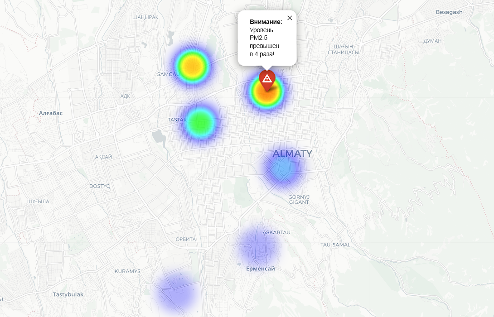

# 🌍 NiceSmog: Almaty Air Quality Interactive Heatmap




## 📌 Описание проекта
**NiceSmog** — это Open Source проект, направленный на решение проблемы визуализации загрязнения воздуха в Алматы. Проект предоставляет интерактивную тепловую карту (Heatmap) в реальном времени, помогая жителям выбирать более чистые районы для прогулок и спорта.

## 📊 Источники данных (Data Disclosure)
На текущем этапе (MVP/Prototype):
*   **Тип данных:** Имитационные данные (Mock Data). 
*   **Статус:** В файле `app.py` захардкожены координаты и уровни PM2.5 для демонстрации работы тепловой карты.
*   **Roadmap:** В следующей фазе планируется интеграция через API с **AirKaz** и **OpenAQ** для получения реальных показателей в режиме 24/7.

## 🎯 Проблема и решение
*   **Проблема:** Сложность интерпретации «сухих» цифр уровня PM2.5 для обычных граждан.
*   **Решение:** Визуализация данных в виде интуитивно понятной тепловой карты, наложенной на карту города.

## 🇺🇳 Соответствие целям SDG
1.  **SDG 3 (Хорошее здоровье):** Снижение воздействия токсичного смога на легкие горожан.
2.  **SDG 11 (Устойчивые города):** Создание открытой инфраструктуры мониторинга для «умного» города.

## 💎 Почему это DPG (Digital Public Good)?
Проект полностью соответствует принципам DPG:
*   **Open Source:** Код доступен под лицензией MIT.
*   **Open Data:** Планируемая интеграция с OpenAQ и AirKaz.
*   **Privacy:** Проект не собирает персональные данные пользователей.

## 📊 Анализ рынка (SWOT)
| Сильные стороны (Strengths) | Слабые стороны (Weaknesses) |
| :--- | :--- |
| Локальный фокус на Алматы, открытый код | Зависимость от внешних API (AirKaz) |
| **Возможности (Opportunities)** | **Угрозы (Threats)** |
| Подключение волонтерских DIY-датчиков | Конкуренция с закрытыми приложениями (IQAir) |

## 🛠 Технологии и Прототип
*   **Язык:** Python 3.x
*   **Библиотеки:** Folium (Leaflet.js wrapper), Branca.
*   **Прототип:** Файл `app.py` генерирует интерактивную HTML-карту.

## 🚀 Быстрый запуск (Quick Start)

Чтобы запустить прототип и увидеть карту на своем компьютере, выполните эти шаги:

### Шаг 1: Клонирование
Откройте терминал и скачайте проект:
```bash
git clone https://github.com/Ransa19/NiceSmog.git
cd NiceSmog
```
### Шаг 2: Установка библиотек
Установите необходимые инструменты (Folium и Branca):

```Bash
pip install -r requirements.txt
```
### Шаг 3: Генерация карты
Запустите Python-скрипт:

```Bash
python app.py
```
### Шаг 4: Просмотр
После запуска в папке появится файл index.html. Просто дважды кликните по нему, и он откроется в вашем браузере как обычный сайт с картой.

## 👥 Команда и Роли
*   Абилтаев Улан — *Full-Stack Developer / Project Manager*.
    *   Разработка прототипа (Python/Folium).
    *   Создание документации и SWOT-анализа.
    *   Управление Governance-моделью проекта.

## 🤝 Как помочь проекту (Contributing)
Мы приветствуем вклад сообщества! Подробности в файле [CONTRIBUTING.md](./CONTRIBUTING.md).

## 📄 Лицензия
Этот проект распространяется под лицензией **MIT**. Подробности в файле [LICENSE](./LICENSE).

## 🤖 Использование ИИ
При разработке проекта использовались инструменты ИИ (Gemini):
*   Генерация примеров для вдохновения.
*   Генерация базового кода для визуализации карты (Folium).
*   Помощь в структурировании документации по стандартам DPG.
